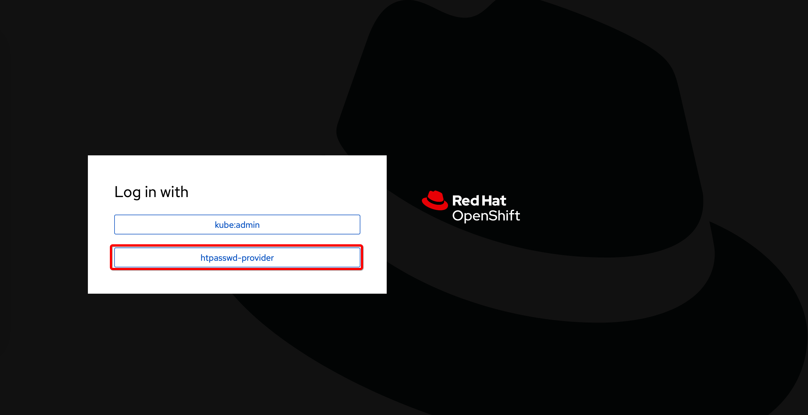
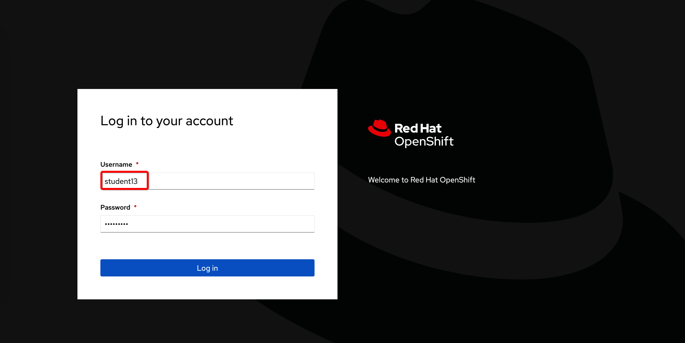
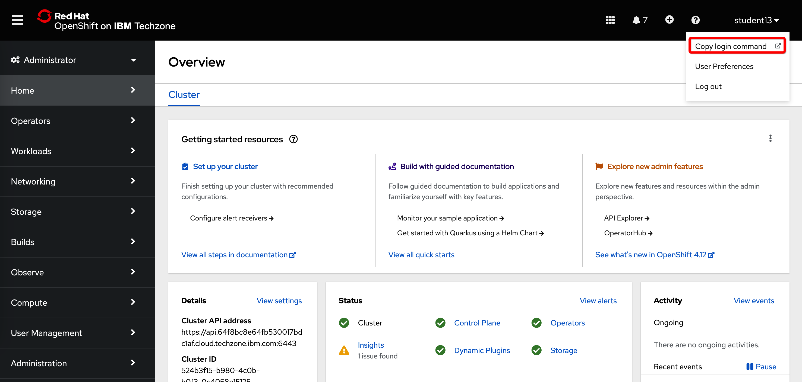
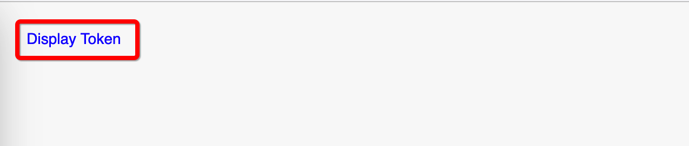
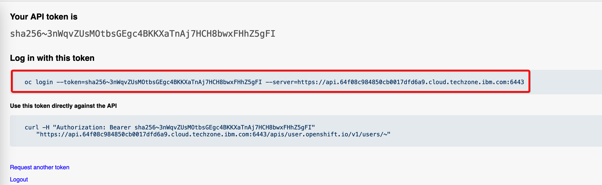

## Login to OpenShift

Please use **htpasswd-provider**

Login with the user name assigned to you:

In order to logn to the command line interface, lick on the username in the upper right corner and select **Copy login command**:

Click on **Displey token**:

Select and copy the login command:

Paste the command into the terminal window.
