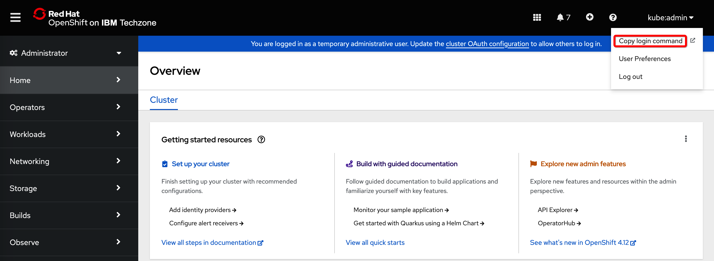

## Login to OpenShift

>Note: the username in the following illustrations is kube:admin, in your case it will be student01, student02,...

Click on the username in the upper right corner and select **Copy login command**:

Click on **Displey token**:

Select and copy the login command:

Paste the command into the terminal window.

<!-- TODO: Login to OpenShift screenshots -->
