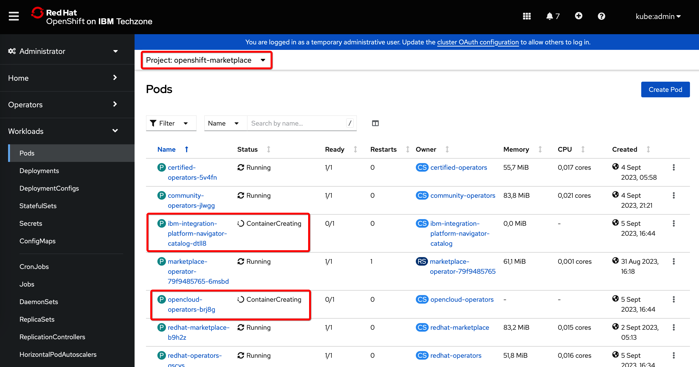
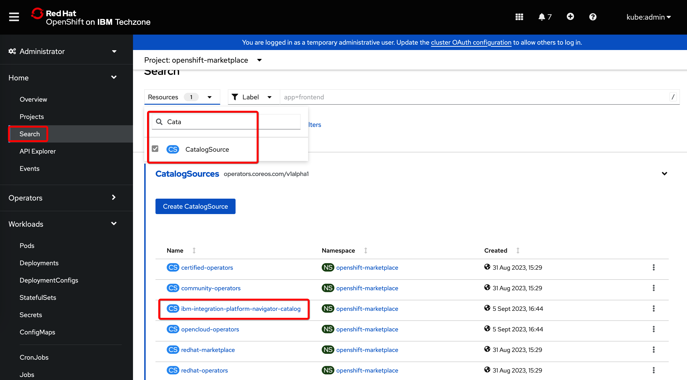

## Platform navigator

Check the latest version:<br>
https://github.com/IBM/cloud-pak/tree/master/repo/case/ibm-integration-platform-navigator


**Linux/Mac**

  - Prepare
    ```sh
    export CASE_NAME=ibm-integration-platform-navigator && export CASE_VERSION=7.1.2
    ```
  - Run
    ```sh
    oc ibm-pak get ${CASE_NAME} --version ${CASE_VERSION}
    oc ibm-pak generate mirror-manifests ${CASE_NAME} icr.io --version ${CASE_VERSION}
    cd ~/.ibm-pak/data/mirror/${CASE_NAME}/${CASE_VERSION}
    oc apply -f catalog-sources.yaml
    ```

**Windows**

Open command prompt as an administrator - in this example as user **Admin**

  - Prepare
    ```bat
    set CASE_NAME=ibm-integration-platform-navigator
    set CASE_VERSION=7.1.2
    ```
  - Run
    ```bat
    oc ibm-pak get %CASE_NAME% --version %CASE_VERSION%
    oc ibm-pak generate mirror-manifests %CASE_NAME% icr.io --version %CASE_VERSION%
    cd C:\Users\Admin\.ibm-pak\data\mirror\%CASE_NAME%\%CASE_VERSION%
    oc apply -f catalog-sources.yaml
    ```


If you navigate to the OpenShift console and switch to the **openshift-marketplace** project, you will see the process of creating the pods used to manage the imported catalogs:



And if you search for the CatalogSource object type, you'll see imported catalog sources:

