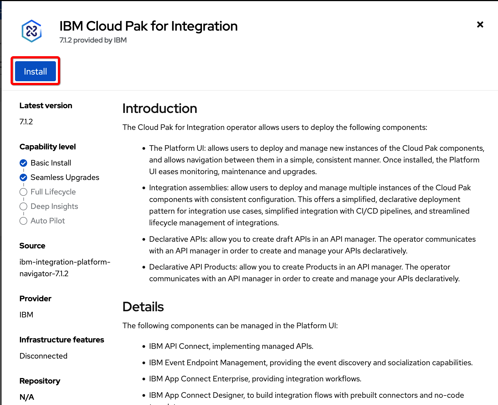
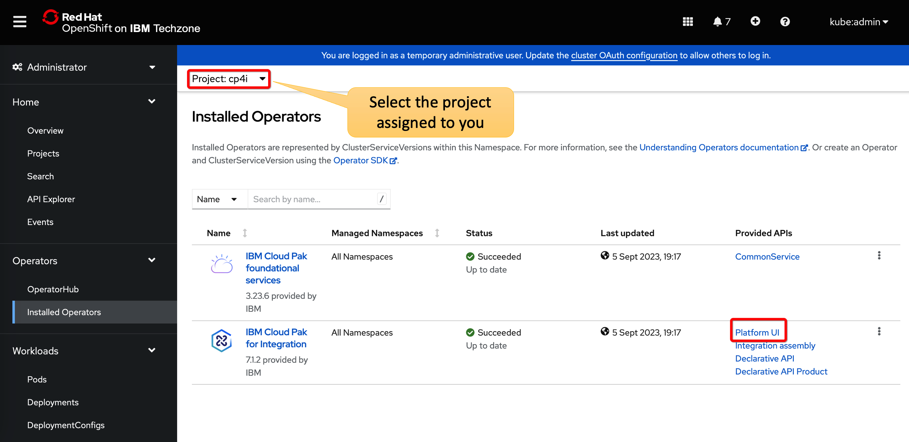
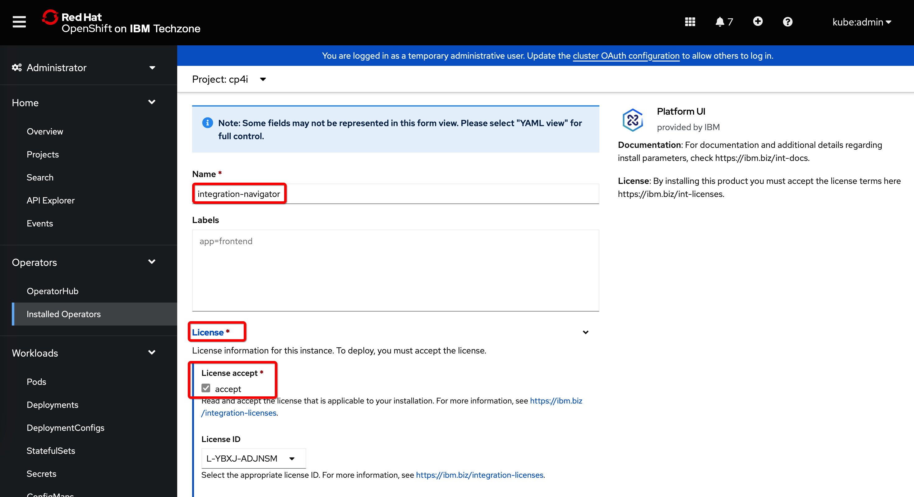
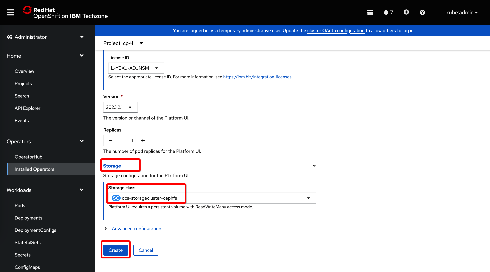
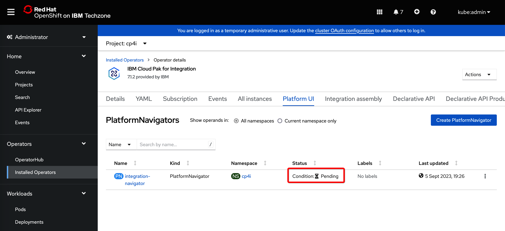
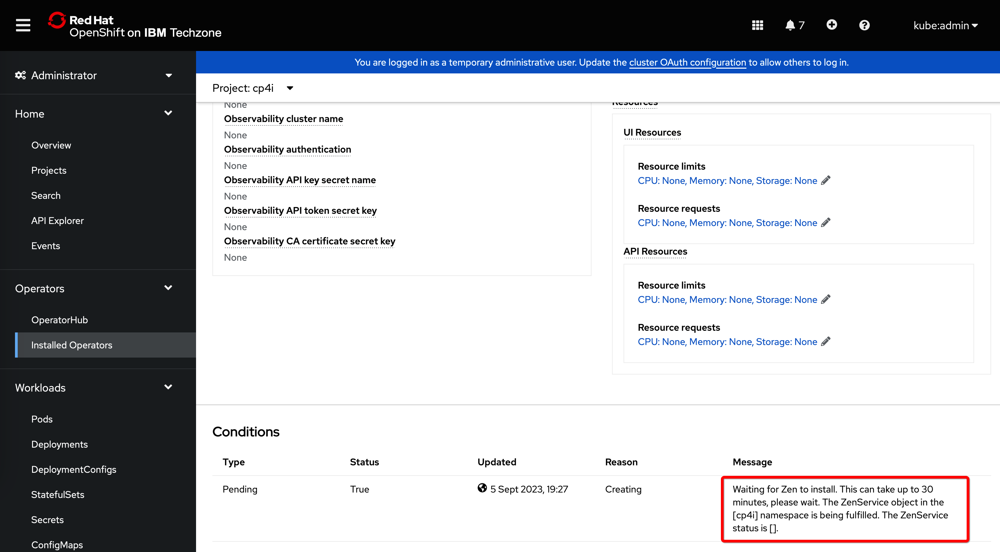
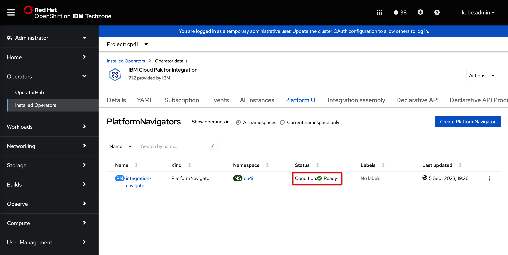

## Create instance of the Platform Navigator

Prepare the IBM Entitlement key. Normaly, the key would be obtained on the following site: https://myibm.ibm.com/products-services/containerlibrary but for the workshop, it will be provided by the instructor.

Create an environment variable, for example:
- **Linux/Mac:**
  ```sh
  export ENTITLEMENT_KEY=...YOUR_ENTITLEMENT_KEY... 
  ```
- **Windows:**
  ```bat
  set ENTITLEMENT_KEY=...YOUR_ENTITLEMENT_KEY... 
  ```

If you have instlled *podman* or *docker* on your machine, you can verify the key with:
- **Linux/Mac:**
  ```sh
  podman login cp.icr.io --username cp --password $ENTITLEMENT_KEY
  ```
  or
  ```sh
  docker login cp.icr.io --username cp --password $ENTITLEMENT_KEY
  ```
- **Windows:**
  ```bat
  podman login cp.icr.io --username cp --password %ENTITLEMENT_KEY%
  ```
  or
  ```bat
  docker login cp.icr.io --username cp --password %ENTITLEMENT_KEY%
  ```


We will also need an OpenShift project. To create a new project we would use command `oc new-project ...`But, for this workshop, there is the set of projects called *student01, student02...* etc, already predefined. Use the project name provided for you by the instructor.

You may put it in the environment variable
- **Linux/Mac:**
  ```sh
  export PROJECT=...YOUR_PROJECT_NAME...
  ```
- **Windows:**
  ```bat
  set PROJECT=...YOUR_PROJECT_NAME...
  ```

Create an OpenShift secret with the entitlement key in that project. The secret name must be **ibm-entitlement-key**:
- **Linux/Mac:**
  ```sh
  oc create secret docker-registry ibm-entitlement-key --docker-username=cp --docker-password=$ENTITLEMENT_KEY --docker-server=cp.icr.io --namespace=$PROJECT
  ```
- **Windows:**
  ```bat
  oc create secret docker-registry ibm-entitlement-key --docker-username=cp --docker-password=%ENTITLEMENT_KEY% --docker-server=cp.icr.io --namespace=%PROJECT%
  ```

We will continue in the OpenShift web console (discuss with the instructor possibilties of completing the same steps from command line).


Click on the **OperatorHub** and in the search filed enter *CP4I* to display all operators related to the *Cloud Pak for Integration*. The list depends on the previously imported catalog sources. Click on the opeartor tile called **IBM Cloud Pak for Integration**:


Click on **Install**:

  

Select the latest channel. Under installation mode, select option **A specific namespace on the cluster**, and for the **Installed Namespace** choose the **project that is assigned to you**:


Scroll down, select **Automatic approval** and confirm by clicking on **Install**:


Click on **Installed Operators** select the **project assigned to you** and under **Cloud Pak for Integration** row click on the link **Platform UI**:



Click on the button **Create PlatformNavigator**:


Give it some name, click on **License** and confirm that you accept it:

 

Scroll down and select the storage class. It must be RFX file type of the storage. In our environment we already have prepared **ocs-storagecluster-cephfs** class - select it. Click on **Create** to confirm:



The instance will appear on the list. It will be in the pending state (don't worry if you see an error for a moment, this is normal).



If you click on the instance name to open the details page and scroll down, you will see the description of the current state. It can take up to 45 minutes before the instance is created. Please be patient.

 

Once when it is created the state will change to **Ready**:




