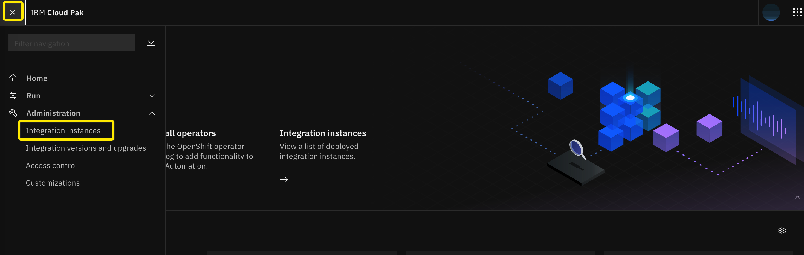
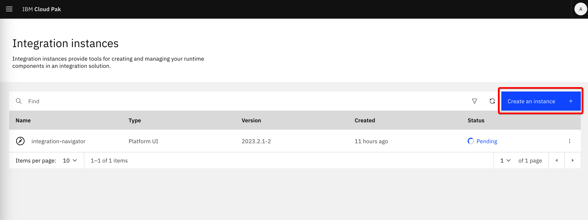
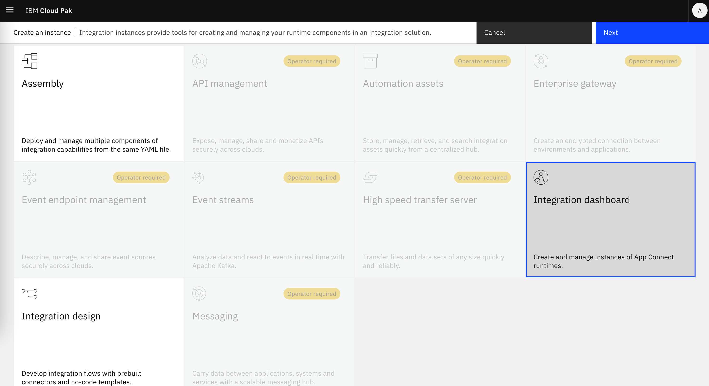

## Capability instance

After the catalog sources were imported, click on **OperatorHub** and similarly as before when we installed Platform UI, enter *CP4I* in the search field. You will see a new set of tiles.

Select any of the operators. For example **IBM App Connect**. We will go through the same steps as before when we installed Platform UI operator. Click on **Install**:

Select the latest **Update channel**, install in **Specific namespace**, select the **project assigned to you**, select **Automatic** update and confirm by clicking on **Install**:

The operator installation process starts:

 

> ***--------- You can repeat the same steps for other integration products. ---------***

 

Switch to the Platform user interface (a.k.a. Platform Navigator) and from the menu select **Administration/Integration instances**

Click on **Create instance**:

Those capabilities for which we have installed operators are available, others are "greyed out"

Our workshop ends here. Details on the installation and configuration of specific capabilities (integration products) are beyond the scope of the workshop. Talk to your instructor about next steps. 
