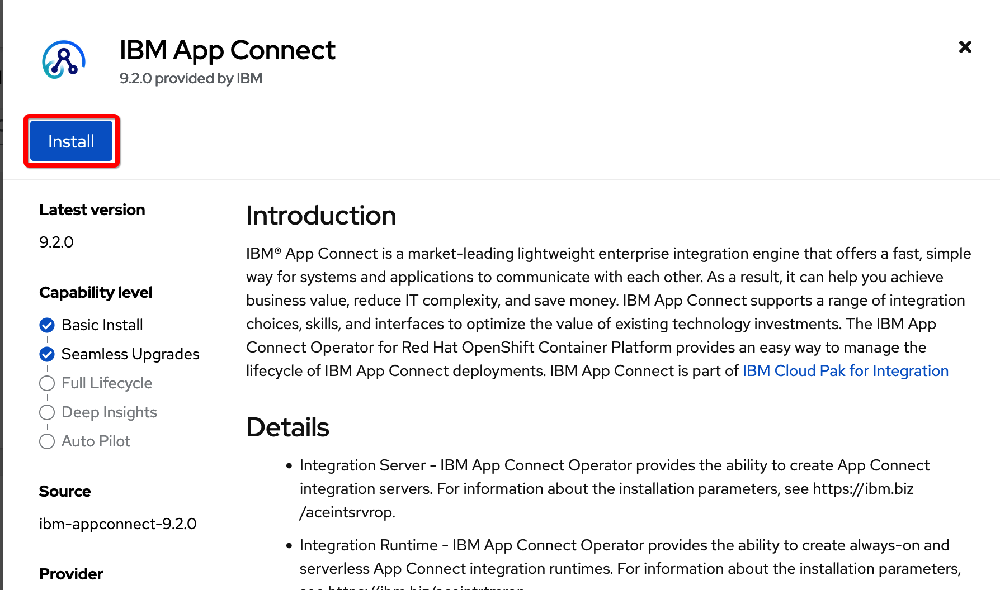

## Capability instance

After the catalog sources were imported, click on **OperatorHub** and similarly as before when we installed Platform UI, enter *CP4I* in the search field. You will see a new set of tiles.

Select any of the operators. For example **IBM App Connect**. We will go through the same steps as before when we installed Platform UI operator. Click on **Install**:

Select the latest **Update channel**, install in **Specific namespace**, select the **project assigned to you**, select **Automatic** update and confirm by clicking on **Install**:

The operator installation process starts:

---
> ***You can repeat the same steps for other integration products.***
---

